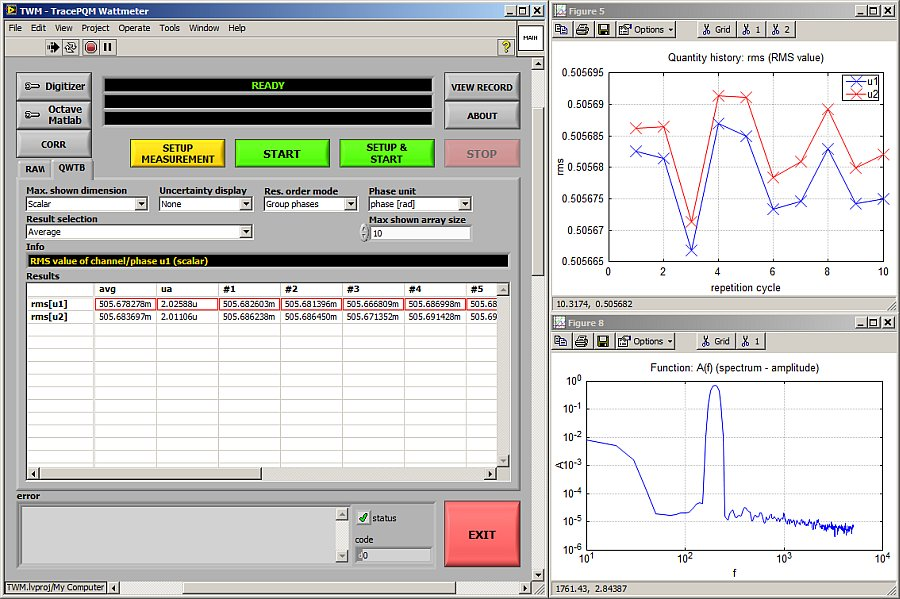

# TWM - TracePQM Wattmeter

TWM is developed in scope of [EMPIR](https://msu.euramet.org/calls.html) project [TracePQM](http://tracepqm.cmi.cz/).

TWM is a transparent, metrology grade measurement system for traceable measurement of the Power and Power Quality (PQ) parameters. However, it is not restricted to power and PQ area only. It is designed to allow recording of the voltage and current waveforms using various digitizers and processing the measured waveforms using ANY algorithm. It is composed of two main components:
- User interface and instrument control in [LabVIEW](http://www.ni.com/labview/),
- [GNU Octave](https://www.gnu.org/software/octave/) or [Matlab](https://uk.mathworks.com/products/matlab.html) calculation scripts for data processing.

Both components are connected together into the single interactive application using [GOLPI](https://github.com/KaeroDot/GOLPI) interface. Note the current version does not support Matlab yet, however interface to the Matlab is already in development.

The TWM concept is modular, so it can be simply extended by various digitizer drivers whereas the rest of the application stays unchanged. In the current version the TWM supports:
- [niScope](http://sine.ni.com/nips/cds/view/p/lang/cs/nid/12638) drivers for control of NI's PXI-5922 digitizer for wideband measurements (can be unlocked for other cards as well...),
- Synchronized [HP/Agilent/Keysight 3458A](https://www.keysight.com/en/pd-1000001297%3Aepsg%3Apro-pn-3458A/digital-multimeter-8-digit?cc=US&lc=eng) sampling multimeters for precision measurements,
- [DirectSound](http://www.elektronika.kvalitne.cz/SW/dsdll/dsdll_eng.html) driver for ordinary soundcard for test purposes and low accuracy measurements,
- Simulated digitizer for debug purposes (synthesizer of the composite harmonics signal).

Modularity of the Power and PQ calculation algorithms used by the TWM is ensured by the [QWTB](https://qwtb.github.io/qwtb/) toolbox. 

## Algorithms
Current version includes following algorithms:
- TWM-PSFE: Calculation of fundamental harmonic parameters by Phase Sensitive Frequency Estimator for non-coherent sampling (frequency, amplitude and phase).
- TWM-FPNLSF: Calculation of fundamental harmonic parameters by four parameter fitting for non-coherent sampling (frequency, amplitude, phase, offset).
- TWM-MODTDPS: Calculation of amplitude modulation parameters for sine and rectangular modulation for non-coherent sampling.
- TWM-Flicker: Calculation of short-term flicker severity according IEC 61000-4-15 for non-coherent sampling.
- TWM-THDWFFT: Total Harmonic Distortion calculator and harmonics analyser for non-coherent sampling.
- TWM-PWRTDI: Four quadrant power meter by time-domain integration method for non-coherent sampling.
- TWM-HCRMS: Half-cycle RMS calculator for PQ event detection according IEC 61000-3-40 for non-coherent sampling.
- TWM-InDiSwell: PQ event detection according IEC 61000-3-40 for non-coherent sampling.

Details on the algorithms can be found in the [draft document A2.4.4 - Algorithms Description](https://github.com/smaslan/TWM/blob/master/doc/A244%20Algorithms%20description.pdf).

## Status

The project is still under development! In current version it can do following:
- Digitize waveforms using one of the supported digitizers in given configuration.
- Store the digitized waveforms in unified format independent of the digitizer.
- Display measured waveforms.
- Load the measured data and execute m-script on them using GNU Octave or Matlab:
  - Direct call of the user m-code,
  - or call of the algorithm from the QWTB toolbox.
- Display calculated results.
- Batch processing of recorded data.

## News

Important changes and news:
- 2017-11-20: First release.
- 2017-12-08: Matlab support.
- 2018-03-16: Improved GUI, few algorithms added.
- 2018-08-23: Improved GUI, 8 of 10 algorithms included (not validated yet!).

## Download

Here you can download build only:

[Current build, V1.3.0.0, 2018.08.23 (ZIP file)](./builds/TWM.zip)

## License
The TWM is distributed under [MIT license](./LICENSE.txt). Note the algorithms in the QWTB toolbox may have different licenses. 
  
  